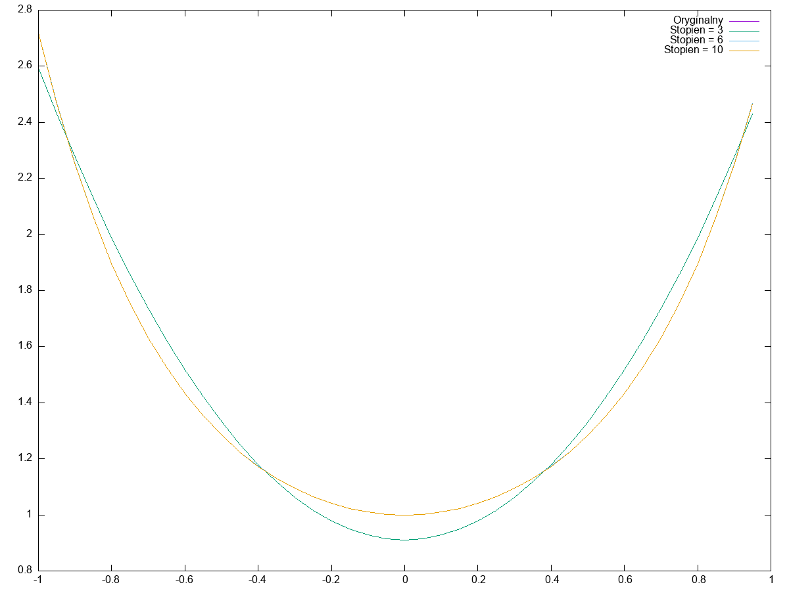
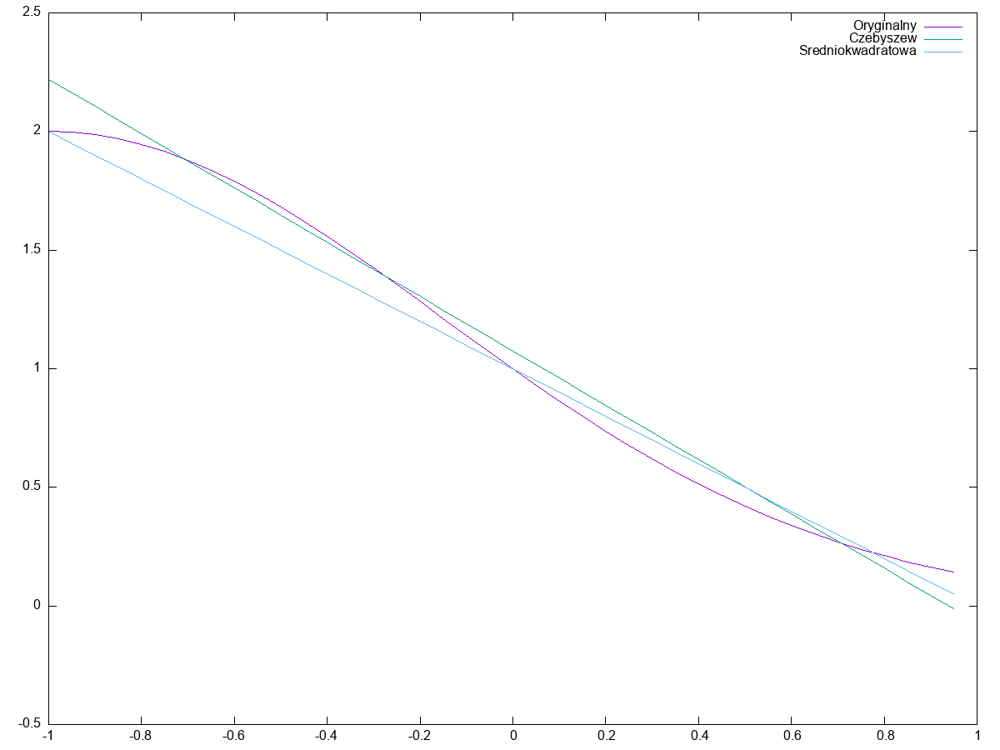

Kuba Walusiak, Juliusz Kościołek 09.04.2022, Laboratorium 3

# Aproksymacja funkcji, aproksymacja w bibliotece GSL

## Zad 1

### Polecenie

Proszę zastosować aproksymację Czebyszewa dla funkcji:

```
y = exp((x**2) w przedziale od -1 do 1
y = abs(x+x**3) w przedziale od -1 do 1
y = sign(x) w przedziale od -1 do 1
```

Dla każdej funkcji proszę:

* narysować wykres funkcji aproksymowanej i aproksymującej (gnuplot)
* sprawdzić, jak wynik zależy od stopnia wielomianu aproksymującego - przedstawić odpowiednie wykresy

### Wykonanie

Uruchomiono program `czebyszew/main.c`, który wygenerował pliki tekstowe:

* `abs-original` - wartości funkcji `abs`
* `exp-original` - wartości funkcji `exp`
* `sign-original` - wartości funkcji `sign`
* `abs-approxN` - aproksymacja funkcji `abs` za pomocą wielomianów Czebyszewa, gdzie N to stopień wielomianu. Użyte
  stopnie to 3, 6 i 10.
* `exp-approxN` - aproksymacja funkcji `exp` za pomocą wielomianów Czebyszewa, gdzie N to stopień wielomianu. Użyte
  stopnie to 3, 6 i 10.
* `sign-approxN` - aproksymacja funkcji `sign` za pomocą wielomianów Czebyszewa, gdzie N to stopień wielomianu. Użyte
  stopnie to 3, 6 i 10.

Polecenie kompilujące program `czebyszew/main.c` to:

```
gcc main.c -lgslcblas -lgsl -lm -o main && ./main
```

Ponadto, program `czebyszew/main.c` wygenerował następujące pliki:

* `abs.png` - wykres dla funkcji `abs`, zawierający oryginalną funkcję i aproksymacje za pomocą wielomianów Czebyszewa
* `exp.png` - wykres dla funkcji `exp`, zawierający oryginalną funkcję i aproksymacje za pomocą wielomianów Czebyszewa
* `sign.png` - wykres dla funkcji `sign`, zawierający oryginalną funkcję i aproksymacje za pomocą wielomianów Czebyszewa

Wykresy wygenerowano za pomocą programu `gnuplot`. Program `gnuplot` wywołano z poniższymi poleceniami:

```
gnuplot -e "set terminal png size 1200,900; set output 'exp.png'; \
  plot 'exp-original.txt' with lines title 'Oryginalny', \
  'exp-approx3.txt' with lines title 'Stopien = 3', \
  'exp-approx6.txt' with lines title 'Stopien = 6', \
  'exp-approx10.txt' with lines title 'Stopien = 10'"
gnuplot -e "set terminal png size 1200,900; set output 'abs.png'; \
  plot 'abs-original.txt' with lines title 'Oryginalny', \
  'abs-approx3.txt' with lines title 'Stopien = 3', \
  'abs-approx6.txt' with lines title 'Stopien = 6', \
  'abs-approx10.txt' with lines title 'Stopien = 10'"
gnuplot -e "set terminal png size 1200,900; set output 'sign.png'; \
  plot 'sign-original.txt' with lines title 'Oryginalny', \
  'sign-approx3.txt' with lines title 'Stopien = 3', \
  'sign-approx6.txt' with lines title 'Stopien = 6', \
  'sign-approx10.txt' with lines title 'Stopien = 10'"
```

### Wykresy

Dla funkcji `abs`:


Dla funkcji `exp`:



Dla funkcji `sign`:


## Zad. 2

### Polecenie

1. Wykonać aproksymację funkcji `f(x)=(1/2)**( x**2+2x)`, gdzie x należy do przedziału `(-1,1)` przy pomocy aproksymacji
   średniokwadratowej
2. Znaleźć aproksymację tej funkcji przy pomocy aproksymacji jednostajnej i porównać tę aproksymację z wynikiem z p1.

### Wykonanie

Stworzono program [czebyszew-a-sredniokwardatowa](czebyszew-a-sredniokwadratowa/main.c), aproksymujący podaną funkcję
przy użyciu średniokwadratowej regresji liniowej oraz wielomianu Czebyszewa o stopniu 1. Program wygenerował pliki
tekstowe z danymi, a następnie, przy użyciu programu gnuplot, wykonał wykres pokazujący zadaną funkcję wraz z
aproksymacjami.



Jak widać, aproksymacje się różnią, co jest skutkiem różniących się funkcji błędu. Żadna z nich nie wydaje się
znacząco "gorsza" od drugiej.

## Źródła

Użyte źródła:

- [Przykład średniokwadratowej regresji liniowej w GSL](https://www.gnu.org/software/gsl/doc/html/lls.html#simple-linear-regression-example)
- [Dokumentacja aproksymacji wielomianami Czebyszewa w GSL](https://www.gnu.org/software/gsl/doc/html/cheb.html)
- [Dokumentacja programu gnuplot](http://gnuplot.info/docs_5.5/gnuplot5.html)